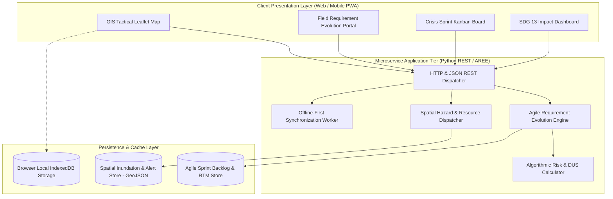
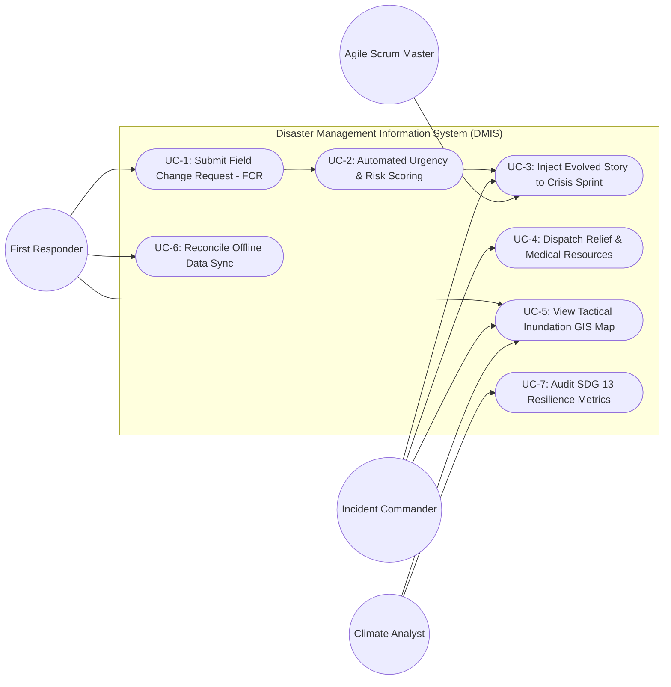
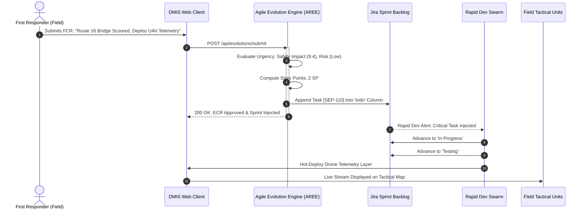
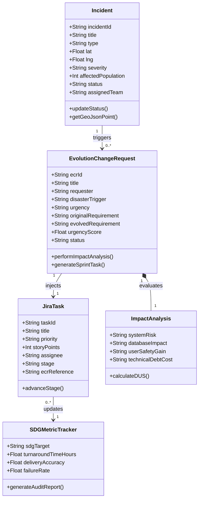
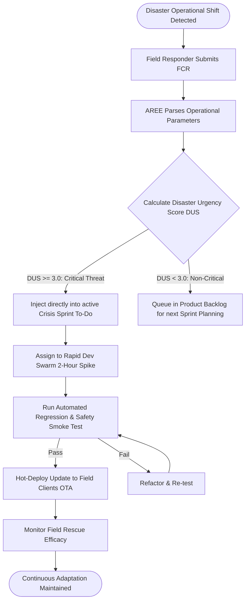

# Software Architecture & UML Specifications
## Topic: Agile Requirement Evolution Framework for a Disaster Management Information System (DMIS)
### Enterprise Architecture Specification | Multi-Stakeholder Collaboration Model

---

## 1. System Architecture Diagram (C4 Component Model)
This diagram can be rendered in Draw.io, Lucidchart, or MS Visio:

---

## 2. UML Use Case Model
Captures stakeholder interactions across First Responders, Incident Commanders, Agile Scrum Teams, and Climate Analysts:

---

## 3. UML Sequence Diagram: Rapid Requirement Evolution Cycle
Demonstrates the sub-3-minute workflow from hazard detection to sprint card creation:

---

## 4. UML Class Diagram
Object-oriented class structures enforcing modularity and requirement traceability:

---

## 5. Agile Activity Diagram (Workflow Logic)
Visualizes decision gates for emergency requirement acceptance vs. deferred backlog:

